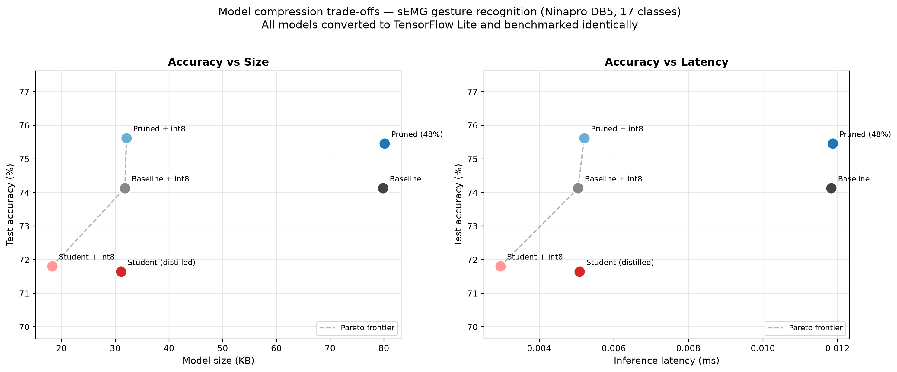

# sEMG Edge AI — model compression for wearable gesture recognition

Compressing a 1D-CNN for hand-gesture recognition from surface EMG (Ninapro DB5, Myo armband), and measuring what that compression costs.

Built as a pilot study for University of Liverpool PhD ref CSPR002 (Edge AI for wearable sEMG, EnduRAI / Horizon Europe).

---

## Results

A 1D-CNN was trained to classify 17 hand gestures from 16 sEMG channels, then compressed using int8 quantisation, magnitude pruning, and knowledge distillation. Every model was converted to TensorFlow Lite and benchmarked through an identical pipeline.

| Model | Params | Size | Latency | Accuracy |
|---|---|---|---|---|
| Baseline | 18,545 | 79.9 KB | 0.012 ms | 74.13% |
| Baseline + int8 | 18,545 | 31.8 KB | 0.005 ms | 74.13% |
| Pruned (48%) | 18,545 | 80.1 KB | 0.012 ms | 75.46% |
| **Pruned + int8** | 18,545 | **32.1 KB** | **0.005 ms** | **75.62%** |
| Student (distilled) | 5,697 | 31.1 KB | 0.005 ms | 71.64% |
| **Student + int8** | **5,697** | **18.3 KB** | **0.003 ms** | 71.81% |

Chance level is 5.88%.

The most accurate model in the study is also 2.5x smaller and 2.4x faster than the uncompressed baseline. Compression is not purely a cost here.

---

## Findings

**Quantisation is free.** Consistent 2.5x size reduction and 2.3x latency reduction with zero accuracy loss. This matters beyond storage: many embedded processors have no floating-point unit and must emulate float arithmetic in software, so integer inference is what makes deployment viable at all.

**Pruning gives no size benefit, but improves accuracy.** Driving 48.5% of weights to zero produced a fractionally *larger* TFLite file. Standard TFLite stores every weight explicitly, and a zero occupies the same bytes as any other float — sparsity pays off only with a sparse storage format or sparsity-aware hardware. What pruning delivered instead was regularisation: +1.33 pp.

**Distillation helps, but modestly.** A 3.3x smaller student reached 72.87 ± 1.04% against 70.68 ± 0.84% for an identically-architected control trained on hard labels alone — a benefit of +2.19 ± 1.39 pp across five seeds.

**The model has learned physiology, not a shortcut.** SHAP attribution shows each gesture recruiting a distinct subset of electrodes. A model classifying on overall signal amplitude would show an identical importance pattern for every gesture; this one does not.

---

## Measurement corrections

Three initial results were artefacts of the measurement method rather than properties of the models. Each was identified and corrected.

**Baseline latency was Python overhead.** `model.predict()` measured 21 ms; through TFLite the same model runs in 0.012 ms. The original figure was almost entirely Keras call overhead. Comparing it against a compressed TFLite model would have implied a spurious 1,750x speedup.

**The pruning size reduction was a file-format artefact.** Pruning initially appeared to give 4.45x compression — but this compared a `.keras` file against a `.h5` file, two formats carrying different metadata. Measured through TFLite, the effect disappears entirely (1.0x).

**The distillation result was not reproducible across single runs.** Two identical runs produced effects of -2.99 pp and +1.49 pp, of opposite sign. Run-to-run variance from random initialisation alone was ~4.6 pp, larger than the effect being measured. Repeated seeding (5 seeds) was required to establish that the effect is real, positive, and small.

All final numbers are measured through a single TFLite pipeline with identical timing methodology.

---

## Cross-subject transfer

The model trained on subject 1 scores 74.13% on subject 1 and 27.62% on subject 2 — a 46.5 pp collapse. Three candidate explanations were tested:

| Hypothesis | Test | Result |
|---|---|---|
| Armband rotation (make the model invariant to it) | electrode-shift augmentation, 3 seeds | Refuted — -14.1 pp within-subject, -11.0 pp cross-subject |
| Amplitude / scaling differences | three normalisation strategies | Refuted — accounts for 7% of the gap; rest-based calibration is actively harmful (-13.8 pp) |
| Armband rotation (correct for it) | oracle search over all 8 possible shifts | Refuted — the optimal rotation is no rotation; the ceiling on the approach is zero |

All three are rejected. The gap is not geometric and not a scaling artefact: it is anatomical and behavioural. Different forearms produce genuinely different spatial signatures for the same intended gesture — not rotated or rescaled versions of one another, but different signals. No preprocessing transformation maps one onto the other because no such transformation exists.

This rules out rotation-invariant architectures as a direction, and is consistent with the fact that commercial gesture-control armbands have universally required per-user calibration.

Follow-on study: `semg-cross-subject` — how far does multi-subject training actually get?

---

## Interpretability and deployment

EnduRAI is a human-centred project; the end user is a worker wearing a device for a full shift.

A model that is right 75% of the time is wrong about that person's body once every four gestures. Without an account of why a decision was made, the wearer has no basis to accept the system, and no basis to challenge it when it errs.

Compression makes such a device feasible — an 18 KB model runs on the sensor itself, keeping raw muscle data on the wearer's arm rather than streaming it to a server. Interpretability is what makes it acceptable. Both are necessary; neither is sufficient alone.

---

## Method

- **Split by repetition, never randomly.** The six repetitions of each gesture are near-identical; a random split places near-duplicates in both train and test. Train on repetitions 1/3/4/6, validate on 2, test on 5.
- **Normalisation statistics computed from the training set only.** Training data normalises to exactly 0.000 / 1.000; test data to 0.0026 / 1.0040. The discrepancy confirms no leakage.
- **Rest windows excluded**, giving a balanced 17-class problem consistent with standard DB5 protocol. This assumes gesture onset detection is handled upstream.
- **200 ms windows.** Wearable control requires end-to-end latency below roughly 300 ms to feel responsive; the window forms part of that budget.
- **Global average pooling rather than Flatten**, chosen to keep the dense layer small for the deployment target.
- **Negligible 50 Hz mains contamination** was found in the power spectrum, consistent with the Myo's wireless, battery-powered design. The notch filter is retained as standard practice but has minimal effect on this dataset.

## Limitations

- Main results are within-subject. Cross-subject transfer is evaluated separately and degrades substantially.
- Latency is measured on a laptop CPU, not on target hardware. Relative ordering should hold; absolute values will not.
- The rotation experiments assume DB5 channels 0-7 and 8-15 correspond to the two Myo armbands. This should be verified against the Ninapro documentation.

---

## Repository
src/
preprocess.py       band-pass, notch, rectify, smooth
windowing.py        200 ms windows, 50% overlap, purity check
prepare_data.py     drop rest, split by repetition, normalise
model.py            1D-CNN architecture and training
quantise.py         int8 conversion, three-way size measurement
prune.py            magnitude pruning to 48% sparsity
distil.py           knowledge distillation with control
distil_repeated.py  5-seed evaluation
benchmark.py        all models, one TFLite pipeline
plot_tradeoff.py    Pareto trade-off chart
interpret.py        SHAP attribution
robustness.py       cross-subject evaluation
rotation_aug.py     rotation hypothesis (refuted)
norm_test.py        amplitude hypothesis (refuted)
alignment.py        rotation correction (refuted)
results/findings.md   full write-up
figures/              all figures, reproducible

## Running
python3 -m venv venv && source venv/bin/activate
pip install numpy scipy scikit-learn matplotlib tensorflow tensorflow-model-optimization shap
place Ninapro DB5 subjects in data/raw/
python src/prepare_data.py
python src/model.py
python src/benchmark.py
python src/plot_tradeoff.py

Data is not included. Register at [ninapro.hevs.ch](http://ninapro.hevs.ch/) to download DB5.

## Dataset

Pizzolato, S. et al. (2017) 'Comparison of six electromyography acquisition setups on hand movement classification tasks', *PLoS ONE*, 12(10), e0186132.
